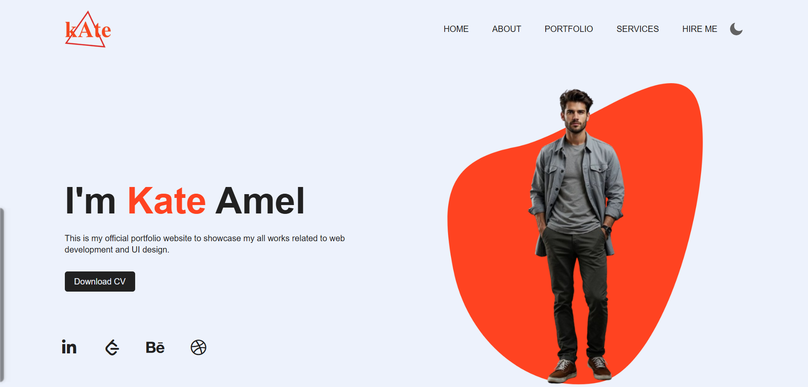
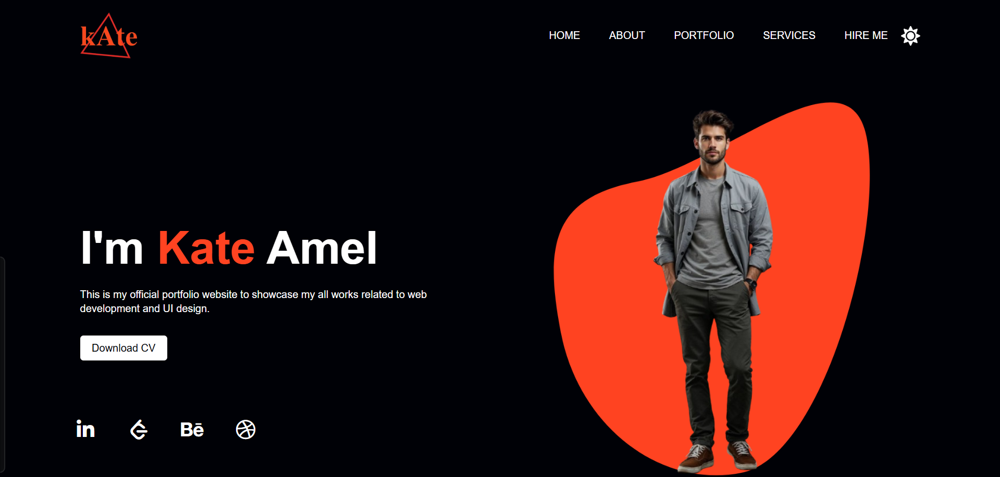

# 🎨 Portfolio Landing Page

A modern and responsive portfolio landing page built using HTML, CSS, and JavaScript. This project showcases a clean UI design with smooth image hover animations, dark/light mode toggle, and interactive elements for presenting personal projects and skills.

---

## 🚀 Features

* ✅ Clean and modern UI design
* ✅ Smooth image hover animation effect
* ✅ Responsive layout structure
* ✅ Interactive navigation bar
* ✅ Social media icon integration
* ✅ Download CV button
* ✅ 🌙 Dark & Light mode toggle
* ✅ Beginner-friendly project

---

## 🛠️ Technologies Used

* 👉🏻 HTML5 – Structure
* 👉🏻 CSS3 – Styling, Layout & Animations
* 👉🏻 JavaScript – Dark mode functionality
* 👉🏻 Font Awesome – Icons

---

## 📂 Project Structure

```
portfolio-landing-page/
├── index.html
├── style.css
├── script.js
├── media/
│    ├── logo.png
│    ├── pattern.png
│    ├── person.png
│    ├── moon.png
│    ├── sun.png
```

---

## ⚙️ How It Works

* 1️⃣ Navigation bar provides links to different sections
* 2️⃣ Hero section introduces the user with name and role
* 3️⃣ Image container uses hover effects for animation
* 4️⃣ CSS transitions create smooth movement
* 5️⃣ Social icons allow external profile linking
* 6️⃣ Dark/light mode toggles using JavaScript and CSS variables

---

## 📸 Preview

Example:



---

## 🎨 UI & Interaction Details

* Uses Flexbox for layout alignment
* Hover effects applied on images for dynamic UI
* Clean typography and color contrast
* Button styled using anchor tag
* Smooth transitions using CSS

---

## 🧪 Behavior Handling

* 1. Navigation items align horizontally
* 2. Image moves on hover using CSS transitions
* 3. Elements are positioned using absolute & relative positioning
* 4. Layout adapts to screen size using percentage units
* 5. Theme changes dynamically using CSS variables

---

## 🌐 Live Demo

👉🏻 https://suraj-charan-dev.github.io/portfolio-landing-page/

---

## 📥 Installation

1. Clone the repository:

   ```
   git clone https://github.com/your-username/portfolio-landing-page.git
   ```

2. Open the project folder

3. Run `index.html` in your browser

---

## 🤝 Contributing

Contributions are welcome!

Feel free to fork this repository and submit a pull request.

---

## 💡 Future Improvements

* 🔥 Make fully responsive (mobile-first design)
* 🔥 Add more sections (About, Projects, Contact)
* 🔥 Add form validation
* 🔥 Improve accessibility (ARIA, alt attributes)
* 🔥 Enhance animations and UI

---
